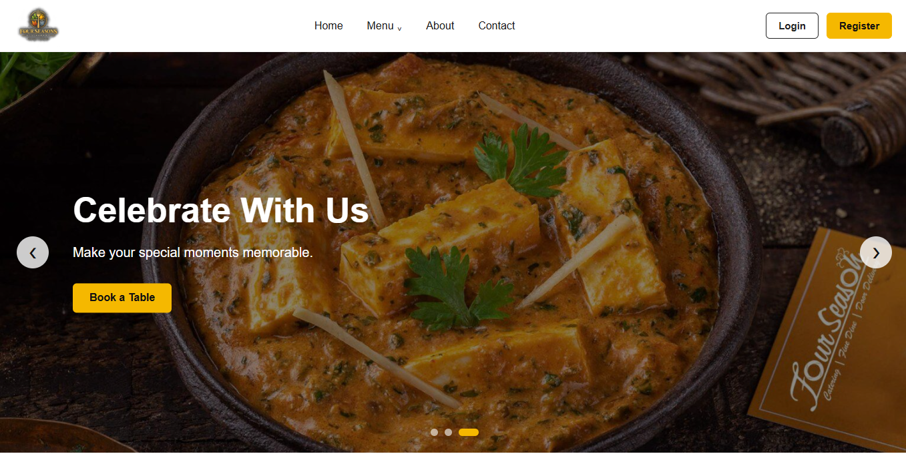
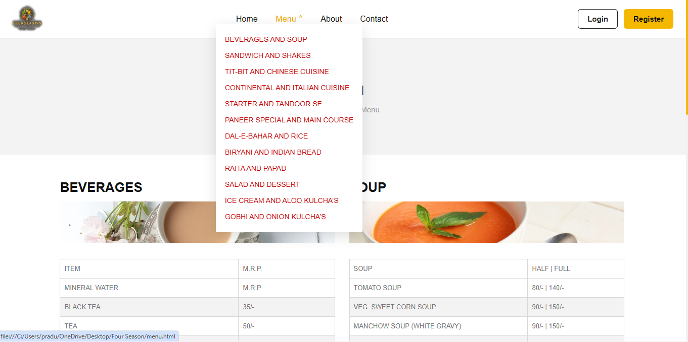
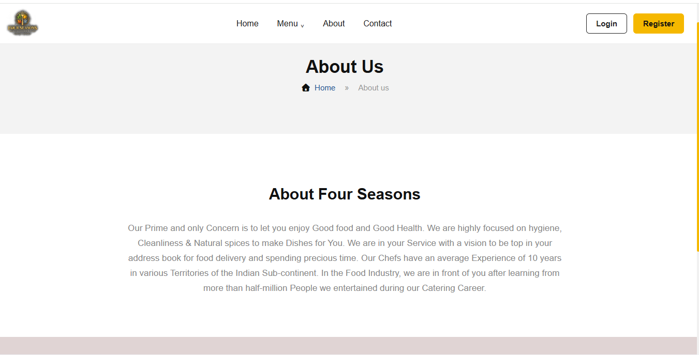
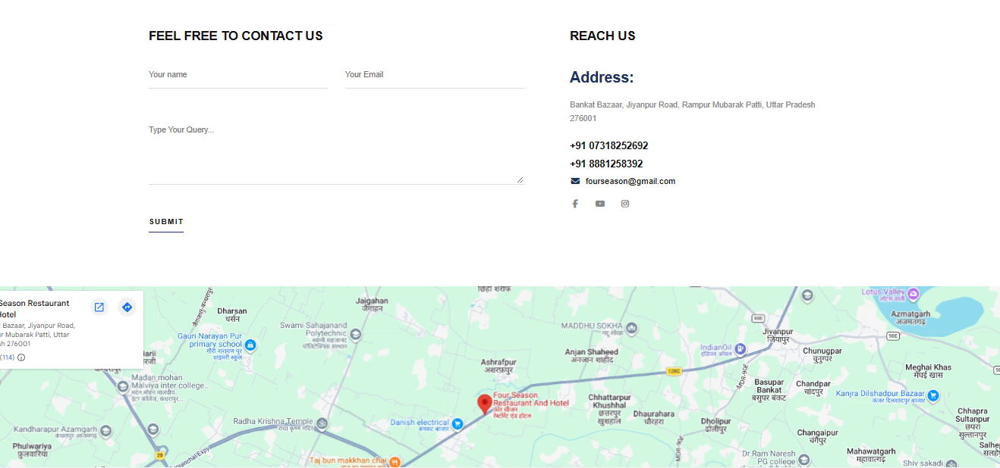
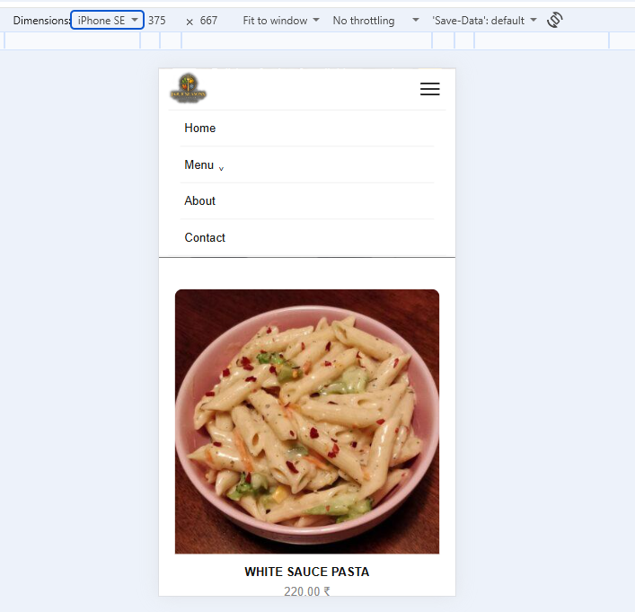
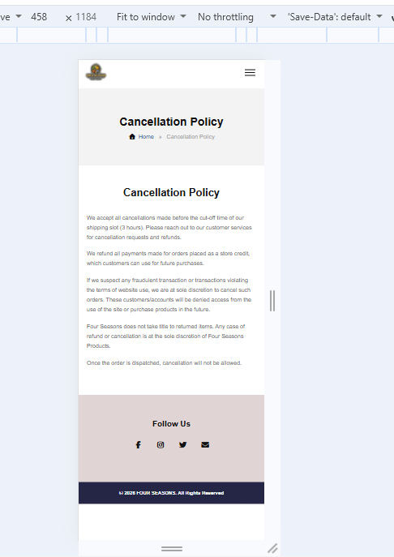
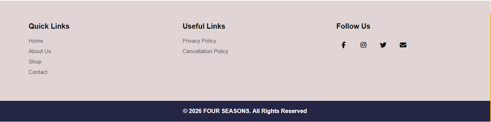
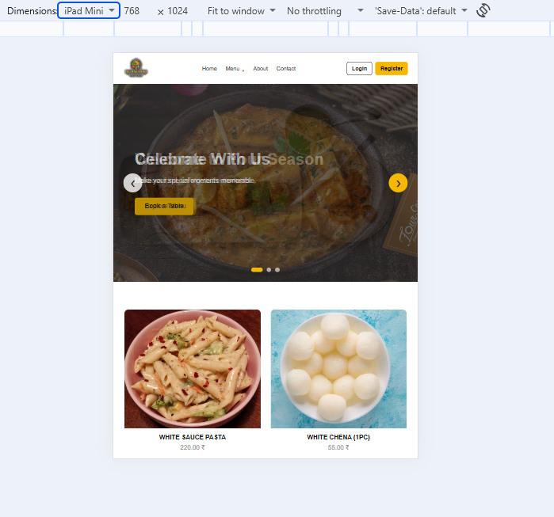
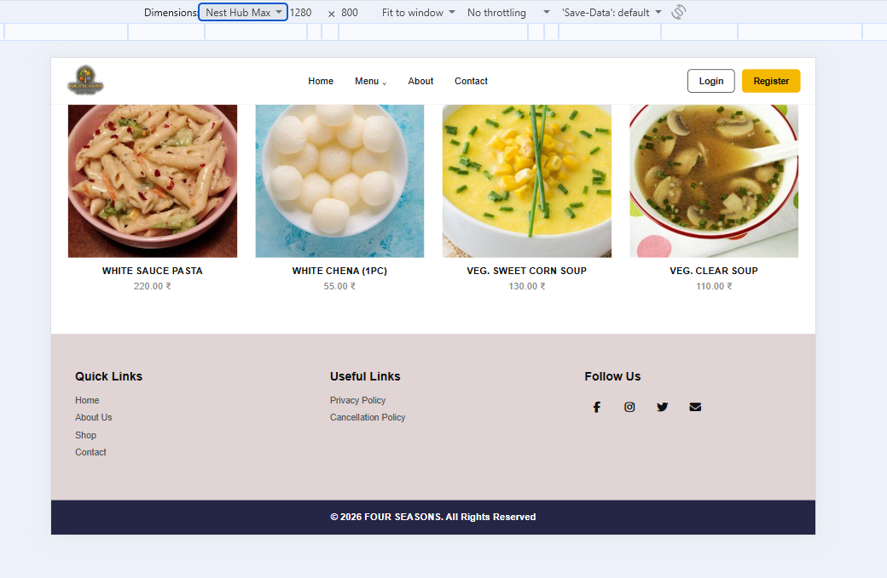

# Four Season Restaurant Website

## Live Demo

**Live Website:** https://fourseasonazm.netlify.app

---

## 📌 Project Overview

**Four Season Restaurant Website** is a modern, responsive, and user-friendly restaurant website developed as part of a Web Development Internship project.

The website is designed to provide customers with information about the restaurant, explore the food menu, view different menu categories, contact the restaurant, and access important policies.

The project focuses on creating a clean user interface, responsive layouts, interactive elements, form validation, and proper navigation between multiple web pages.

---

## 🎯 Project Objectives

* Build a complete multi-page business website.
* Create a responsive design for desktop, tablet, and mobile devices.
* Provide an easy-to-use restaurant menu.
* Implement interactive navigation and a hero image slider.
* Add contact form validation using JavaScript.
* Include restaurant location using Google Maps.
* Optimize the website structure and images for better performance.
* Deploy the website using free hosting.

---

## ✨ Features

### 🏠 Home Page

* Responsive navigation bar
* Restaurant logo
* Desktop navigation menu
* Mobile hamburger menu
* Menu dropdown with food categories
* Hero image slider
* Previous and Next slider buttons
* Slider navigation dots
* Automatic image sliding
* Food cards with images, names, and prices
* Responsive footer

### 🍴 Menu Page

* Multiple food categories
* Food items with prices
* Responsive menu tables
* Category navigation through dropdown links
* Desktop two-column layout
* Mobile single-column layout

### 👨‍🍳 About Page

* Restaurant introduction
* Clean banner section
* Breadcrumb navigation
* Responsive content layout

### 📞 Contact Page

* Contact form
* Name validation
* Email validation
* Query validation
* Error messages
* Success message
* Restaurant contact information
* Social media icons
* Google Maps location
* Responsive contact layout

### 📄 Additional Pages

* Privacy Policy
* Cancellation Policy

### 📱 Responsive Design

The website is designed to work across:

* Desktop
* Laptop
* Tablet
* Mobile
* Small mobile screens

---

## 🛠️ Technologies Used

| Technology   | Purpose                               |
| ------------ | ------------------------------------- |
| HTML5        | Website structure and semantic markup |
| CSS3         | Styling and responsive design         |
| JavaScript   | Interactivity and form validation     |
| Font Awesome | Icons                                 |
| Google Maps  | Restaurant location                   |
| Git & GitHub | Version control and project hosting   |
| Netlify      | Website deployment                    |

---

## 📂 Project Structure

```text
FOUR SEASON/
│
├── css/
│   └── style.css
│
├── images/
│   ├── logo.png
│   ├── FS-1.jpg
│   ├── FS-2.jpg
│   ├── FS-3.jpg
│   ├── m1.jpg
│   ├── m2.jpg
│   ├── m3.jpg
│   └── m4.jpg ..etc
│
├── screenshots/
│   ├── home.png
│   ├── menu.png
│   ├── about.png
│   ├── contact.png
│   └── mobile.png ..etc
│
├── js/
│   └── script.js
│
├── index.html
├── about.html
├── contact.html
├── menu.html
├── privacy-policy.html
├── cancellation-policy.html
└── README.md
```

---

## 💻 Technical Details

### HTML5

HTML5 is used to create the structure of the website.

Semantic elements such as:

* `<header>`
* `<nav>`
* `<main>`
* `<section>`
* `<footer>`
* `<form>`

are used to maintain a structured and readable HTML document.

### CSS3

CSS3 is used for:

* Layout design
* Colors
* Typography
* Spacing
* Hover effects
* Animations
* Grid and Flexbox
* Responsive design
* Navigation styling
* Hero slider styling
* Menu cards
* Footer
* Form styling

CSS media queries are used to make the website responsive on different screen sizes.

### JavaScript

JavaScript is used for:

* Mobile hamburger menu
* Opening and closing navigation
* Closing the mobile menu after selecting a link
* Hero slider
* Previous and Next buttons
* Slider dots
* Automatic slide change
* Contact form validation
* Error messages
* Success message

---

## 📋 Form Validation

The contact form includes client-side validation.

### Name

* Required field
* Minimum 3 characters

### Email

* Required field
* Valid email format is checked using JavaScript

### Query

* Required field
* Minimum 10 characters

If the input is invalid, an appropriate error message is displayed.

If all fields are valid, a success message is displayed.

---

## 🖼️ Image Optimization

Images are used carefully throughout the website to maintain a good balance between visual quality and performance.

Optimization practices include:

* Proper image dimensions
* Appropriate image formats
* Meaningful `alt` attributes
* Responsive image sizing
* Lazy loading for suitable images
* `object-fit: cover` for consistent image presentation

---

## 📱 Responsive Design

The website uses CSS media queries for different screen sizes.

### Desktop

* Full navigation menu
* Login/Register buttons
* Four-column food card layout
* Two-column menu layout

### Tablet

* Reduced navigation spacing
* Two-column food card layout
* Responsive content sections

### Mobile

* Hamburger navigation
* Single-column food cards
* Single-column menu layout
* Responsive contact form
* Mobile-friendly footer
* Adjusted typography and spacing

---

## 🧭 Navigation

The website contains navigation between multiple pages:

* Home
* Menu
* About
* Contact
* Privacy Policy
* Cancellation Policy

The Menu dropdown also provides direct links to different food categories.

---

## 🧪 Testing

The website was tested for:

* Navigation functionality
* Mobile hamburger menu
* Menu dropdown
* Hero slider
* Previous/Next buttons
* Slider dots
* Automatic slider
* Contact form validation
* Error messages
* Success message
* Responsive layout
* Footer links
* Internal page navigation
* Google Maps section
* Different screen sizes
* Horizontal overflow
* Basic browser compatibility

### Responsive Testing

The website was checked on:

* Desktop
* Tablet
* Mobile
* Small mobile screens

---

## 📸 Screenshots

### Home Page


### Menu Page


### About Page



### Contact Page



### Mobile Responsive View



### Cancellation Policy Page Responsiveness



### Footer View



### Tablet View



### Mini Desktop View



---

## 🚀 Installation & Setup

Follow these steps to run the project locally.

### 1. Clone the Repository

```bash
git clone https://github.com/pradum6391-wq/four-season-restaurant.git
```

### 2. Open the Project

Open the project folder in Visual Studio Code.

### 3. Run the Website

Open `index.html` in a browser.

You can also use the **Live Server** extension in Visual Studio Code.

---

## 🌐 Deployment

The website can be deployed using free hosting platforms such as:

* Netlify
* GitHub Pages

### Netlify Deployment

1. Create an account on Netlify.
2. Connect the GitHub repository.
3. Select the project repository.
4. Deploy the website.
5. Copy the generated live URL.
6. Replace the Live Demo URL in this README.

### GitHub Pages Deployment

1. Open the GitHub repository.
2. Go to **Settings**.
3. Open **Pages**.
4. Select the `main` branch.
5. Select the root folder.
6. Save the settings.
7. GitHub will generate the live website URL.

---

## 📦 GitHub Repository

**Repository:**
https://github.com/pradum6391-wq/four-season-restaurant

---

## 🎨 Design Decisions

The website uses a clean restaurant-focused design with:

* White background
* Yellow/golden accent color
* Dark text
* Simple typography
* Responsive grid layouts
* Minimal card design
* Smooth hover effects
* Large food imagery
* Clear navigation

The design was created to keep the website simple, readable, and easy to navigate.

---

## 🔐 Accessibility & Usability

The project includes:

* `alt` attributes for images
* Clear navigation
* Responsive layouts
* Descriptive form fields
* Visible validation messages
* Clickable phone and email links
* Mobile-friendly navigation
* Keyboard-friendly form controls

---

## 📈 Future Improvements

The following features can be added in future versions:

* Online table booking system
* User Login and Registration
* Backend integration
* Database for menu items
* Online food ordering
* Payment gateway
* Admin dashboard
* Customer reviews
* Real social media links
* Email notification system
* Reservation management

---

## 📚 Learning Outcomes

Through this project, I practiced and improved my understanding of:

* HTML5 semantic structure
* CSS3 styling
* Flexbox
* CSS Grid
* Responsive Web Design
* Media Queries
* JavaScript DOM manipulation
* JavaScript event handling
* Form validation
* Image optimization
* Multi-page website development
* Git and GitHub
* Website deployment

---

## 👨‍💻 Author

**Pradum Maurya**

BCA Student | Web Development Learner

### Connect With Me

* GitHub: https://github.com/pradum6391-wq
* LinkedIn: https://linkedin.com/in/pradum-maurya-902a0b379

---

## 📄 Internship Project

**Project:** Complete Business Website
**Category:** Restaurant Website
**Business:** Four Season Restaurant
**Development Type:** Responsive Multi-Page Website
**Status:** Completed

---

## ⭐ Conclusion

The Four Season Restaurant Website is a complete responsive business website developed using HTML5, CSS3, and JavaScript.

The project demonstrates the implementation of a multi-page website, responsive layouts, interactive navigation, image slider, menu sections, contact form validation, Google Maps integration, and deployment-ready project structure.

The project was developed with a focus on clean design, usability, responsiveness, and practical web development skills.

---

**© 2026 Pradum Maurya. All Rights Reserved.**
